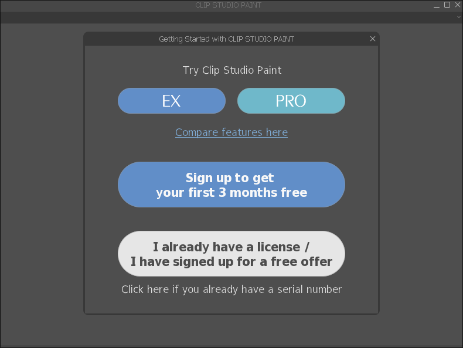

# Clip Studio Paint


## Basic setup

A basic Clip Studio Paint wine prefix is fairly easy to setup:

- wine: latest, version 10 or above
- winecfg: Windows 8.1
- winetricks: none

```sh
export WINEPREFIX=/path/to/your/prefix
winecfg /v win81
wine ~/Downloads/ClipStudioPaintInstaller.exe
```

That's pretty much it for the base functionality. See
[#optional-wine-tricks](#optional-wine-tricks) for more.

::: tip
Read the [#wine](/docs/wine/introduction/) section first~
:::

::: info
You might need `winbind`. See [#wine](/docs/wine/introduction/)
:::

### Clip Studio

The hard part is getting **Clip Studio** to work:

- v1 and v2: clip studio is half-broken
- v3 and v4: clip studio works with [#webview2](#webview2)

### Quick tips

::: tip Login
It doesn't seem possible at the moment to login from **Clip Studio**, but you
can login from **CLip Studio Paint** and it persists to **Clip Studio**. See
[#activating-your-license](#activating-your-license).
:::

::: tip Downloading assets
You don't need **Clip Studio** to download assets, see the
[#asset-store](#asset-store) section.
:::

::: tip Use latest Clip Studio v3+ with a v1/v2 license
You can use a newer Clip Studio even with an older license. See the
[#mix-and-match](mix-and-match-clip-studio-and-clip-studio-paint-versions)
section.

But I highly recommend you reading the [#advanced-setup](#advanced-setup)
section before attempting it.
:::

::: tip Nix
If you use Nix/NixOS, I wrote a
[flake](https://github.com/h-banii/clip-studio-paint-nix) to package clip
studio paint. Enjoy!

```sh
github:h-banii/clip-studio-paint-nix
└───packages
    └───x86_64-linux
        ├───clip-studio-paint-v1: package 'clip-studio-paint-1.13.2'
        ├───clip-studio-paint-v2: package 'clip-studio-paint-2.0.6'
        ├───clip-studio-paint-v3: package 'clip-studio-paint-3.0.4'
        ├───clip-studio-paint-v4: package 'clip-studio-paint-4.0.3'
        └───default: package 'clip-studio-paint-1.13.2'
```

:::

## Import brushes and settings from previous install

Since clip studio doesn't work in v1 and v2, you can't rely on the cloud
backup. However, you can still manually transfer your data from a previous
installation.

You just need to copy the `AppData/Roaming/CELSYSUserData` folder to your wine
prefix.

```sh
cp /some/installation/CELSYSUserData \
   /new/prefix/drive_c/users/$USER/AppData/Roaming
```

::: tip Get user data from Windows installation
You can mount your Windows partition on Linux (just like a pendrive) and get
the user data files directly from there too.

For example, my windows is installed in a SATA HDD, you can use `lsblk` to
check the partition name:

```sh
$ lsblkk -o NAME,SIZE,FSTYPE,PARTLABEL,MODEL
NAME          SIZE FSTYPE PARTLABEL                    MODEL
sdb         931.5G                                     WDC WD10EZEX-08WN4A0
├─sdb1        100M vfat   EFI system partition
├─sdb2         16M        Microsoft reserved partition
├─sdb3      419.4G ntfs   Basic data partition
└─sdb4        512G btrfs
```

From that I know that my Windows partition is `sdb3` because the filesystem is
`ntfs` and the size 419G matches the total storage I had on Windows.

Now you just need to create a folder to serve as a mountpoint and mount it:

```sh
sudo mkdir /mnt/windows # it could be another location
sudo mount /dev/sdb3 /mnt/windows -t ntfs3
```

Now you can access your Windows files in `/mnt/windows`. Once you're done, you can umount it.

```sh
sudo umount /mnt/windows
```

:::

::: tip Transfer license between prefixes
It's also possible to transfer the license information, to avoid reactivating
it.

See [#transfering-your-license](#transfering-your-license).
:::

## Optional wine tricks

### Chinese/Japanese/Korean fonts

This is useful for assets containing cjk characters and to render fonts in
`Clip Studio` v3+.

```sh
winetricks cjkfonts
```

::: warning Performance in V4 and V4
This severely impacts clip studio's startup time (up to 15 minutes) in v3 and v4.

You can use this custom verb to replace the least amount of fonts necessary:

```sh
# Filename: "lightcjk.verb"

w_metadata lightcjk fonts \
    title="Creates aliases for some fonts using Source Han Sans fonts" \
    publisher="Adobe" \
    year="2019"

load_lightcjk()
{
    w_call sourcehansans

    w_register_font_replacement "Arial" "Source Han Sans"
    w_register_font_replacement "Batang" "Source Han Sans K"
}
```

Then apply it with winetricks

```sh
WINEPREFIX=/my/prefix winetricks /path/to/lightcjk.verb
```

:::

### dxvk

Clip Studio in version 3 and 4 seems to use Direct3D 10, so `dxvk` could
_potentially_ increase performance.

```sh
winetricks dxvk
```

### Webview2

There are two ways of doing that:

- Evergreen Standalone Installer (depends on `wine`)
- Fixed version (depends on `cabextract`)

#### Evergreen Standalone Installer

Download [Evergreen Standalone
Installer](https://developer.microsoft.com/en-us/microsoft-edge/webview2/)
(x64) and install it in a wineprefix:

```sh
export WINEPREFIX=/your/wineprefix
winecfg /v win10 # this is needed for the installation
wine ~/Downloads/MicrosoftEdgeWebView2RuntimeInstallerX64.exe
winecfg /v win7 # this is very important, webview2 requires this
```

::: tip
You can use `winecfg` to set webview2's version to `win7` while CSP uses
`win81`.

But since CSP works fine on `win7`, it's easier to set the global version.
:::

#### Fixed version

You can use this winetrick verb to install it: `winetricks /path/to/webview2.verb`

```sh
# Filename: "webview2.verb"

w_metadata webview2 apps \
    title="Microsoft Edge WebView2" \
    publisher="Microsoft" \
    media="download" \
    file1="Microsoft.WebView2.FixedVersionRuntime.143.0.3650.139.x64.cab"

load_webview2()
{
    w_download "https://msedge.sf.dl.delivery.mp.microsoft.com/filestreamingservice/files/ea30811e-a216-4d55-89f3-c1099862c8fc/Microsoft.WebView2.FixedVersionRuntime.143.0.3650.139.x64.cab" 685b0eecc96c50eacd9384b25ba2b8aa5e7a302d914f5035af0c1e82bd9d334c
    w_try_cabextract -d "${W_PROGRAMS_UNIX}" "${W_CACHE}"/webview2/"${file1}"

    cat > "${W_TMP}"/set-webview2-path.reg <<_EOF_
REGEDIT4

[HKEY_LOCAL_MACHINE\SOFTWARE\Policies\Microsoft\Edge\WebView2\BrowserExecutableFolder]
"*"="${W_PROGRAMS_WIN//\\/\\\\}\\\\${file1%????}"

_EOF_

    w_try_regedit "${W_TMP}"/set-webview2-path.reg

    w_set_winver win7
}
```

::: warning
You need to use `win7` instead of `win81` in the `winecfg` settings.
:::

::: warning
You might need to update the download url and hash.

https://developer.microsoft.com/en-us/microsoft-edge/webview2/
:::

## Asset store

You don't need Clip Studio to use the asset store, you can use your
[browser](https://assets.clip-studio.com/).


The asset store in the browser uses a custom URI protocol to download assets,
you need to make sure you have the desktop entry for it. See the [Desktop
entries](#desktop-entries) section.

## Custom launcher

You can write a basic shell script to launch CSP from the terminal:

```sh
#!/usr/bin/env sh

export WINEPREFIX=/path/to/your/prefix

wine ~/clip-studio-files/CLIP STUDIO PAINT/CLIPStudioPaint.exe "$@"
# OBS.: That $@ at the ends is to repass all arguments to CLIPStudio.exe

wineserver -k
```

Then save it as `clip-studio-paint`, give it execution permissions `chmod +x
clip-studio-paint` and place it inside one of your `PATH` folders.

Usually under `~/.local/bin` or `/usr/local/bin` should be fine.

Placing an executable in the `PATH` allows you to execute it from anywhere
without the full path to it.

::: tip
You can see your `PATH` folders with `echo`

```sh
echo $PATH | tr ':' '\n'
```

:::

::: tip
You can do the same thing for `clip-studio`
:::

## Desktop entries

Wine should create these desktop entries automatically when you install Clip
Studio Paint. If it didn't, you can follow this section to create them
manually.

- ~/.local/share/applications/wine/Programs/CLIP STUDIO/CLIP STUDIO.desktop
- ~/.local/share/applications/wine/Programs/CLIP STUDIO/CLIP STUDIO PAINT.desktop
- ~/.local/share/applications/wine-extension-clip.desktop
- ~/.local/share/applications/wine-protocol-clipstudio.desktop
- ~/.local/share/applications/wine-protocol-clipstudiopaint.desktop

Also, if you changed your prefix location or if you followed the [Advanced
Setup](#advanced-setup), you'll need to update them manually.

:::: details `CLIP STUDIO PAINT.desktop` & `CLIP STUDIO.desktop`

These are used to display the application in search bars, start menu, etc, by
your graphical shell / desktop environment

By default it'll use paths relative to `C:/`, so if you moved the program files
to somewhere else, you need to update it accordingly:

```ini
[Desktop Entry]
Name=CLIP STUDIO PAINT
Exec=env WINEPREFIX='/some/prefix/csp' wine '/home/user/CLIP STUDIO PAINT/CLIPStudioPaint.exe'
Type=Application
StartupNotify=true
Icon=9540_CLIPStudio.0
StartupWMClass=clipstudiopaint.exe
```

```ini
[Desktop Entry]
Name=CLIP STUDIO
Exec=env WINEPREFIX='/some/prefix/csp' wine '/home/user/CLIP STUDIO/CLIPStudio.exe'
Type=Application
StartupNotify=true
Icon=9540_CLIPStudio.0
StartupWMClass=clipstudio.exe
```

::: tip

If you have a custom launcher/script, like the one in
[#custom-launcher](#custom-launcher), then:

```ini
# if you added it to your PATH
Exec=clip-studio
# or use the absolute path to it
Exec=/path/to/my/script/clip-studio
```

:::

::::

:::: details `wine-extension-clip`

This is used to open `.clip` files

```ini
[Desktop Entry]
Exec=env WINEPREFIX='/csp/v1/prefix' wine '/home/user/CLIP STUDIO PAINT/CLIPStudioPaint.exe' %f
Icon=49FD_CLIP STUDIO.0
MimeType=application/x-wine-extension-clip
Name=CLIP STUDIO FORMAT File
NoDisplay=true
Version=1.5
```

::: warning
It's very important for you to keep the `%f` at the end.
:::

::: tip
With the custom launcher:

```ini
Exec=clip-studio-paint %f
```

:::

::::

:::: details `wine-protocol-clipstudio` & `wine-protocol-clipstudiopaint`

These are used to register custom URI protocols, which are used by the asset
store in the browser.

```sh
[Desktop Entry]
Type=Application
Name=CLIP STUDIO
MimeType=x-scheme-handler/clipstudio;
Exec=env WINEPREFIX='/csp/v1/prefix' wine '/home/user/CLIP STUDIO/CLIPStudio.exe' -url %u
NoDisplay=true
StartupNotify=true
Icon=9540_CLIPStudio.0
```

```sh
[Desktop Entry]
Type=Application
Name=CLIP STUDIO
MimeType=x-scheme-handler/clipstudiopaint;
Exec=env WINEPREFIX='/csp/v1/prefix' wine '/home/user/CLIP STUDIO PAINT/CLIPStudioPaint.exe' -url %u
NoDisplay=true
StartupNotify=true
Icon=9540_CLIPStudio.0
```

::: warning
It's very important for you to keep the `-url %u` at the end.
:::

::: tip
With the custom launcher:

```ini
# for clipstudio
Exec=clip-studio -url %u
# for clipstudiopaint
Exec=clip-studio-paint -url %u
```

:::

::::

## Activating your license

The first time you open `clip studio paint` it should give you the following
pop-up. Choose **"I already have a license"** and login with your CELSYS
account.



## Transfering your license

It's very crucial to reduce the amount of times you reactivate your license
because CELSYS has, in theory, a limit on the number of times you can reuse it.

Every time you create a new wine prefix, CSP thinks it's a new machine and will
ask you to reactivate your license. You can circumvent that by simply copying
the prefix where you activated your license instead of creating a new one.

But it's also possible to copy _certain files_ and a _registry key_ to trick
CSP into thinking it's the same machine and it's already activated:

- Copy `drive_c/users/$USER/AppData/Roaming/CELSYS_EN` folder
- Copy `[Software\\CELSYS_EN\\CLIP STUDIO PAINT]` registry key from `user.reg`

After starting CSP in the new prefix, it should ask for permission to collect
data again, but it won't ask you to reactivate.

::: warning
This was only tested with v1 license, I'm not sure if other versions have
different requirements.
:::

## Advanced setup

In order to test different prefixes without worrying about reinstalling Clip
Studio Paint, we need to move the program files out of the prefix:

```sh
mv "${WINEPREFIX}/drive_c/Program Files/CELSYS/CLIP STUDIO 1.5" ~/clip-studio-files
```

Now we can start `clip studio` and `clip studio paint` using

```sh
wine "$HOME/clip-studio-files/CLIP STUDIO/CLIPStudio.exe"
wine "$HOME/clip-studio-files/CLIP STUDIO PAINT/CLIPStudioPaint.exe"
```

This allows us to create, delete, and compare different wine prefixes without
worrying about messing with csp's installation.

```sh
export WINEPREFIX=/some/wineprefix
wine "$HOME/clip-studio-files/CLIP STUDIO/CLIPStudio.exe"

export WINEPREFIX=/some/quirky/wineprefix
wine "$HOME/clip-studio-files/CLIP STUDIO/CLIPStudio.exe"
```

::: warning
You'll need to fix your desktop entry files. See
[#desktop-entries](#desktop-entries).
:::

::: tip
We only need to export an environment variable once. So technically the
`export` could be dropped in the second example above, but it was kept for the
sake of consistency.
:::

## Mix and match Clip Studio and Clip Studio Paint versions

It's possible to use CS and CSP on different versions. That is desirable if you
have v1 or v2, but wants to use the Clip Studio features available in v3 and
v4.

There are two main approaches:

- Use the same wine prefix
- Use 2 separate wine prefixes and symlink the CELSYSUserData folder

The first one is fairly easy and straightforward:

```sh
WINEPREFIX=/shared/prefix /path/to/v4/CLIPStudio.exe
WINEPREFIX=/shared/prefix /path/to/v1/CLIPStudioPaint.exe
```

However, I couldn't log in `Clip Studio`, so I went with the second approach:
keep the prefixes separated.

For the second solution, you need to symlink the
`users/hbanii/AppData/Roaming/CELSYSUserData` folder. That folder stores all
your assets and settings, we need to make sure both v1 and v4 can access it.

Let's suppose you have version v1 with a wine prefix at `~/v1-prefix` and v4 at
`~/v4-prefix`:

```sh
# If you don't have a v4 prefix yet, create one
WINEPREFIX=~/v4-prefix wineboot

# Delete v4's CELSYSUserData
rm -rf ~/v4-prefix/drive_c/users/YOUR-USERNAME/AppData/Roaming/CELSYSUserData

# Now symlink it
ln -s \
    ~/v1-prefix/drive_c/users/YOUR-USERNAME/AppData/Roaming/CELSYSUserData \
    ~/v4-prefix/drive_c/users/YOUR-USERNAME/AppData/Roaming/CELSYSUserData
```

We can't use **Clip Studio** to login at the moment because the login page is
broken, but we can use **Clip Studio Paint** instead:

```sh
WINEPREFIX=~/v4-prefix /path/to/v4/CLIPStudioPaint.exe
```

Follow the [#activating-your-license](#activating-your-license) section to
login. That lets you login even if you don't have a v4 license. Your login
information should persist when you open **Clip Studio**.

Now you can manage your assets with Clip Studio v4:

```sh
WINEPREFIX=~/v4-prefix /path/to/v4/CLIPStudio.exe
```

While still using Clip Studio Paint v1:

```sh
WINEPREFIX=~/v1-prefix /path/to/v1/CLIPStudioPaint.exe
```
